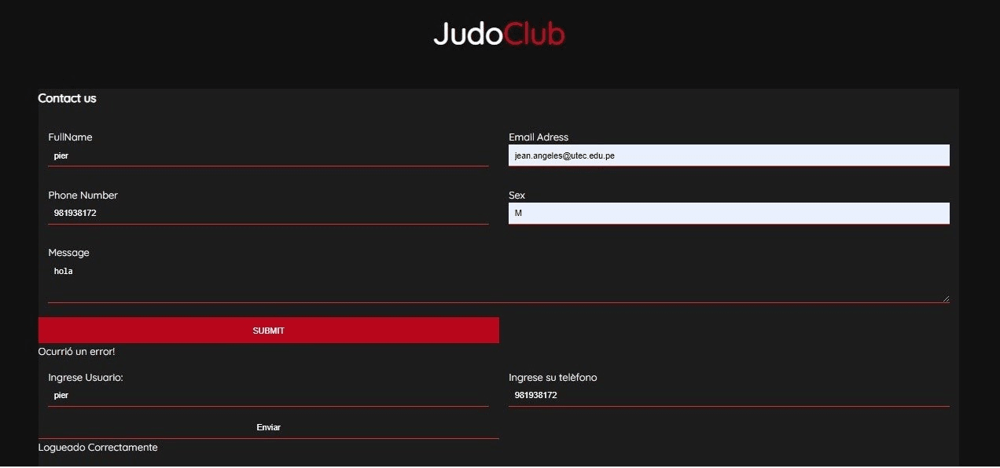
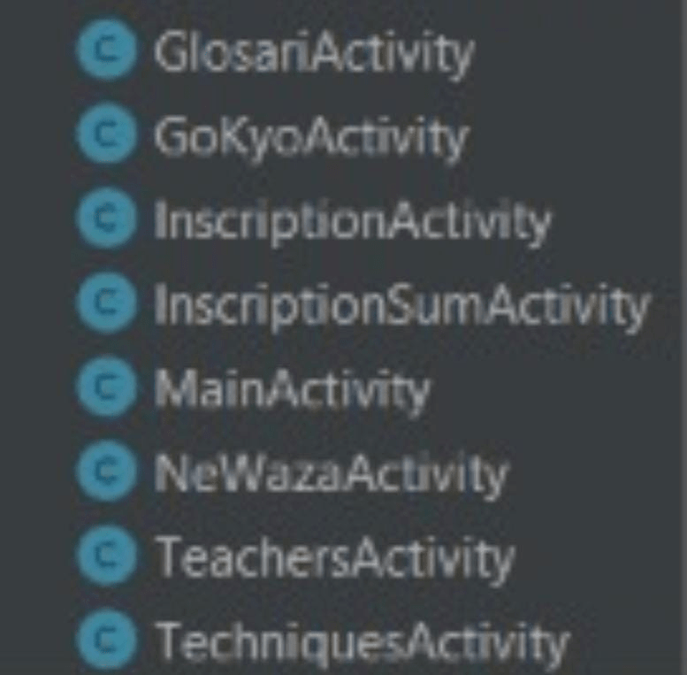
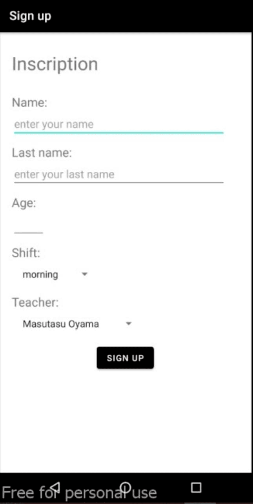

# JudoClub #
#### Integrantes:
1. Marcelo Juan Surco Salas.
2. Harold Alexis Canto Vidal
3. Jean Pier Ángeles.
4. Alberto Domenic Rincon Espinoza.

## Contents
+ [ Descripción del proyecto ](#Desc)
+ [ Objetivos principales / Misión / Visión. ](#opmv)
+ [ Back-end /  Front-end / Base de datos ](#bfb)
+ [ Host ](#host)
+ [ Forma de autenticación ](#aut)
+ [ Manejo de errores ](#me)
+ [ Request y response ](#rr)
+ [ Ejecución del sistema ](#ejec)

<a name="Desc"></a>
## Descripción del proyecto:
Nuestro proyecto cuenta con un modulo de registro y login a través de back y front end, el cual permitirá la inscripción a un taller de Judo de forma virtual, para tener un manejo más organizado de los datos dentro de una base de datos en postgres.

<a name="opmv"></a>
## Objetivos principales / Misión / Visión :
### Objetivos:
El objetivo de este proyecto es crear un sistema que nos permitar hacer registros y logeos basandonos en el modelo cliente servidor. 
### Misión:
Relizar todas las implemetaciones de manera correcta y eficaz.
### Visión:
Tener como resultado final un proyecto muy bueno, capaz de funcionar de manera eficiente.

<a name="bfb"></a>
## Back-end /  Front-end / Base de datos:
### Back-end
Utilizamos flask como framework, este nos permite realizar metodos importantes en la app, además de utilizar SQLAlchemy como ORM para poder convertir las tablas Clases python y así mismo crear modelos.
## Referencias API
Flask-SQLAlchemy
### Front-end
En el Front-end hemos utilizado HTML, CSS, Fetch, JavaScript.
### Base de datos
Hemos utilizado una base de datos relacional, en este caso postgresql.
<a name="host"></a>
## Host
En este caso hemos  utilizado el local host como base de datos, cliente y servidor.
<a name="aut"></a>
## Forma de autenticación:
No soportado por la página

<a name="me"></a>
## Manejo de errores
El manejo de errores se hace a través de un app.errorhandler como se muestra. Además, se maneja solo los posibles errores que puede haber en la app.
``` python 
@app.errorhandler(404)
def page_not_found(err):
    return render_template("page_not_foud.html"),404

@app.errorhandler(403)
def forbidden(err):
    return render_template("forbidden.html"),403

@app.errorhandler(501)
def not_implemented(err):
    return render_template("not_implemented.html"),501
```
<a name="rr"></a>
## Request y response
### Response
El response de la data se hace a través de flask, siendo especificos, de la función render_template, donde le enviamos la data al front-end
``` python
@app.route('/')
def index():
    usuario = Usuario.query.all()
    return render_template('index.html', data=usuario)
```
### Request
El request se hace de manera asincrona a través de fetch.
``` js
 document.getElementById('form').onsubmit = function(e) {
                    e.preventDefault();
                    fetch('/usuarios_nuevos/create', {
                        method: 'POST',
                        body: JSON.stringify({
                            'dzname': document.getElementById('dzname').value,
                            'dzEmail': document.getElementById('dzEmail').value,
                            'dzOther_phone': document.getElementById('dzOther_phone').value,
                            'dzOther_sex': document.getElementById('dzOther_sex').value,
                            'dzMessage': document.getElementById('dzMessage').value
                        }),
                        headers: {
                            'Content-Type': 'application/json'
                        }
                    })
                    .then(function(response){
                        return response.json();
                    })
                    .then(function(jsonResponse) {
                        document.getElementById('error').className = 'hidden';
                        const liItem = document.createElement('LI');
                        liItem.innerHTML = jsonResponse['dzname'];
                        document.getElementById('usuarios_ingresados').appendChild(liItem);
                        const liItem2 = document.createElement('LI');
                        liItem2.innerHTML = jsonResponse['dzEmail'];
                        document.getElementById('usuarios_ingresados').appendChild(liItem2);
                        const liItem3 = document.createElement('LI');
                        liItem3.innerHTML = jsonResponse['dzOther_phone'];
                        document.getElementById('usuarios_ingresados').appendChild(liItem3);
                        const liItem4 = document.createElement('LI');
                        liItem4.innerHTML = jsonResponse['dzOther_sex'];
                        document.getElementById('usuarios_ingresados').appendChild(liItem4);
                        const liItem5 = document.createElement('LI');
                        liItem5.innerHTML = jsonResponse['dzMessage'];
                        document.getElementById('usuarios_ingresados').appendChild(liItem5);
                        document.getElementById('error').className = 'hidden';
                        })
                    .catch(function(error) {
                        document.getElementById('error').className = '';
                    });
                }
```
<a name="ejec"></a>
## Ejecución del sistema
La ejecución del sistema se hace dentro del app.py(solo se tiene que correr el archivo.py).
``` python
if __name__ == '__main__':
    app.run(debug=True, port=5010)
```
## Flask DB Migration
Se utilizó el flask db migration para optimizar el manejo de la base de datos y las versiones de la app. 
``` python
from flask_sqlalchemy import SQLAlchemy
from flask_migrate import Migrate

db = SQLAlchemy(app)
migrate=Migrate(app,db)
```
``` js
def upgrade():
    op.create_table('usuarios_nuevos',
    sa.Column('id', sa.Integer(), nullable=False),
    sa.Column('dzname', sa.String(), nullable=False),
    sa.Column('dzEmail', sa.String(), nullable=False),
    sa.Column('dzOther_phone', sa.Integer(), nullable=False),
    sa.Column('dzOther_sex', sa.String(), nullable=False),
    sa.Column('dzMessage', sa.String(), nullable=False),
    sa.PrimaryKeyConstraint('id')
    )


def downgrade():
    op.drop_table('usuarios_nuevos')
``` 
## App



##Android 


La aplicación judo club te permite acceder al contenido tecnicas, glosario,incripción y maestros. 

## Objetivo
Brindar una aplicación con un sistema de registro que permita al usuario dar conocimiento basico de judo y que le permita generar una idea de cuales son los terminos básicos dentro del judo, las diferentes tecnicas y los maestros con los que cuenta la escuela de judo.

## Misión
Generar una app que permita al usuario realizar una decision en base a lo que le brinda la aplicación.

## Vision
Tener el producto esperado para la completa satisfacción del usuario a la hora de usar la app.

## Activities

## Formulario de registro:


